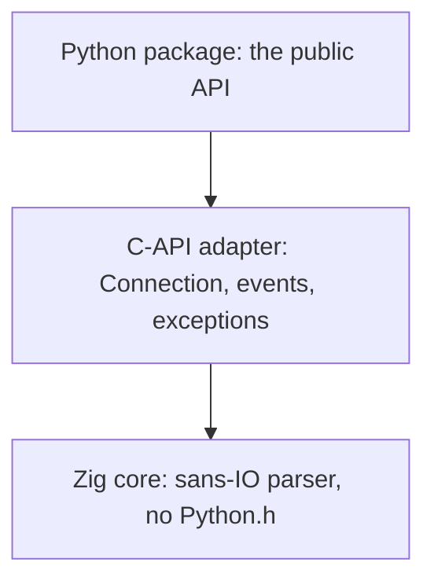

# Architecture

zttp does no I/O, and it's layered so that no layer knows more than it has to: a
pure Zig core that turns bytes into events, a thin C-API edge that adapts that
core to Python, and a small Python package on top. The same shape carries all
three protocols - HTTP/1.1, HTTP/2, and HTTP/3.

## Sans-IO: bytes in, events out

Most parsers are tangled up with how the bytes arrive. They read from a socket,
or they call you back (`on_header(name, value)`, `on_body(chunk)`), and now your
application logic lives inside the parser's callbacks. You don't control the flow
anymore; the parser does. Want to use it with threads instead of asyncio? With a
test that feeds canned bytes? With a new async library? You're rewriting glue.

[Sans-IO](https://sans-io.readthedocs.io/) flips it around. The parser is a pure
state machine over bytes:

* You give it bytes whenever you have them: `receive_data(data)`.
* You ask it what happened, when you're ready: `next_event()`.

It never reads a socket, never calls you back, never blocks. **You** own the I/O
and the control flow; zttp owns only the protocol.

```python
conn = zttp.Connection(zttp.SERVER)
conn.receive_data(raw)        # bytes from wherever: socket, file, test
event = conn.next_event()     # pull, when you want it
```

That shape is what you get for free:

* **Use any I/O.** The same `Connection` works under asyncio, threads, `anyio`, a
  green-thread library, or no I/O at all. zttp doesn't know or care where the
  bytes came from.
* **Trivial to test.** A test is just bytes in, events out - no sockets, no event
  loop, no mocking.
* **Backpressure is yours.** Because you pull events, you decide when to read
  more. The parser never runs ahead of you or buffers without bound (every buffer
  is capped).

[httptools](https://github.com/MagicStack/httptools) (what uvicorn uses today) is
a callback parser: you give it a protocol object with `on_url`, `on_header`,
`on_body`, ... and it calls them as it parses. It's fast, but the control flow is
inverted into your callbacks, and the body gets copied per callback. zttp keeps
the performance of a native engine, since it's written in Zig (see
[Performance](reference/performance.md)), but gives you the cleaner pull API, and
emits each body span as a single `Data` event instead of a stream of callbacks.

| | httptools | zttp |
| --- | --- | --- |
| API | callbacks (`on_header`, `on_body`) | pull (`next_event`) |
| Control flow | inverted into your callbacks | yours |
| Body | copied per callback | one `Data` event per span |
| I/O coupling | none (also sans-IO at the core) | none |

## Layers

zttp is layered the same way [zloop](https://github.com/Kludex/zloop) is, and each
layer depends only on the one below it:



The **core** is pure Zig with no CPython. It's the parser: a sans-IO state machine
that turns bytes into events and back. It's where the real work and the real tests
live, and it builds and runs entirely on its own.

The **adapter** is the only code that touches `Python.h`. It's a thin translation
layer: it backs a `Connection` with the right protocol engine, exposes the events
and exceptions, and materializes the core's byte slices into real Python objects.

The **package** is just the public surface: `Connection`, the roles, the events,
the exceptions, and the `NEED_DATA` sentinel, with type stubs and a `py.typed`
marker.

## One API, three protocols

HTTP/2 and HTTP/3 reuse the same sans-IO pull API. You pick the protocol when you
build the connection:

```python
conn = zttp.Connection(zttp.SERVER, protocol=zttp.HTTP2)
```

The read API (`receive_data` / `next_event`) and the `Request` / `Response` /
`Data` / `EndOfMessage` payloads are **shared** across all three. An HTTP/2 or
HTTP/3 request collapses its pseudo-headers into the same shape HTTP/1.1 uses
(`:method` -> method, `:path` -> target, `:authority` -> a synthesized `host`
header), so the events you handle look the same whatever the wire format was.

What differs is each protocol's **event union**, so its surface is exactly as wide
as its reality. HTTP/1.1 is a single stream and adds nothing. HTTP/2 and HTTP/3
multiplex many concurrent streams over one connection, so every event carries a
`stream_id` and they add the control events they actually have (`RstStream`,
`GoAway`, `Settings`, `Ping`, `WindowUpdate` for H2; `Settings`, `GoAway` for H3).

Multiplexing has to reach a flat, single pull. The resolution is a **single,
arrival-ordered event queue** where every event carries a `stream_id` and the
caller demuxes on it. Wire order is forced anyway (the header-compression dynamic
table is connection-global and order-dependent), so a flat queue is the only
correct shape, and it preserves the one-event-per-`next_event` contract the
HTTP/1.1 reader already has.

HTTP/3 forces one more shift. HTTP/1.1 and HTTP/2 run over TCP, so the kernel
hands zttp an ordered, reliable byte stream and the core only has to *parse* it.
HTTP/3 runs over **QUIC**, a transport built on UDP, so the core also has to *be*
the transport: it owns packet protection, the TLS 1.3 handshake, loss recovery,
congestion control, flow control, and stream multiplexing - everything TCP
normally gives you for free. Because the transport needs to see datagram
boundaries, HTTP/3 takes `receive_datagram(bytes)` instead of
`receive_data(bytes)`:

```python
conn = zttp.Connection(zttp.SERVER, protocol=zttp.HTTP3)
conn.receive_datagram(udp_payload)          # one UDP datagram in
while (event := conn.next_event()) is not zttp.NEED_DATA:
    ...                                      # Request / Data / EndOfMessage, each with .stream_id
```

The sans-IO discipline is unchanged: the core never touches a socket. The boundary
just moved from "decrypted byte stream" (TCP) down to "UDP datagram" (QUIC); the
event side - bytes in, events out, no I/O in the core - is identical.

## Why the write API is imperative, not symmetric with the read API

h11 is symmetric: you read with `conn.next_event()` and write with
`conn.send(h11.Response(...))` - the same event objects flow both ways. zttp is
deliberately **not** symmetric. The read side yields `Request` / `Response` /
`Data` events; the write side is imperative methods (`send_response(status,
headers)`, `send_data(...)`, `end_message(...)`), so the event objects are
read-only outputs and are never constructed by the caller.

This is a considered trade-off:

- **The engine owns framing.** Content-Length vs chunked, HTTP/2 flow-control
  parking, HTTP/3 packetisation against the current clock - the writer decides all
  of it from the connection state. An imperative call passes the minimum the engine
  cannot infer; a symmetric `send(Response(...))` would invite callers to set
  framing fields the engine must then validate or override.
- **Read and write payloads are not the same type.** A parsed `Request` carries a
  synthesized `host` header, `expect_continue`, the decoded `path`/`query`, and a
  `stream_id` the engine assigned. A caller building a request does not supply
  those. Reusing one class for both directions would mean a type whose fields are
  half input, half output.
- **The event objects stay cheap.** They are read-only views over the parse buffer
  with no constructor to validate, which is part of why the read path is fast.

The cost is that a `Response` cannot be built as a value, passed around, and sent
later - the pattern h11 proxies lean on. If a future need makes that compelling,
an additive `stream.send(event)` overload could accept an event object without
removing the imperative methods. Recording the decision here so the asymmetry
reads as intentional, not accidental.

## Memory safety

Because the core is Python-agnostic, every slice it hands out points into a buffer
it owns. The edge materializes those byte slices into real, owned Python `bytes`
objects, so anything that must outlive the next call is copied into stable storage
before it's handed to you. That discipline is what keeps the parser memory-safe
under adversarial, fragmented input, and it's why a `Data` event you hold onto
never dangles into a buffer the core has since reused.

The same rule covers the denial-of-service classes that come with multiplexed
protocols: the header-block floods, the compression bombs, rapid-reset, and the
flow-control and padding guards are all defended in the core, and a fatal
transport or protocol error poisons the connection terminally - exactly as a parse
error does on the HTTP/1.1 side.

## Why Zig

Zig gives a small, dependency-free C-ABI extension with manual control over memory
and layout (the things that make a parser fast) without the build complexity of
C++ or the overhead of a heavier runtime. The same Zig source cross-compiles to
every platform's wheel, and the safety-checked build mode turns would-be memory
bugs into clean, trapped errors.
