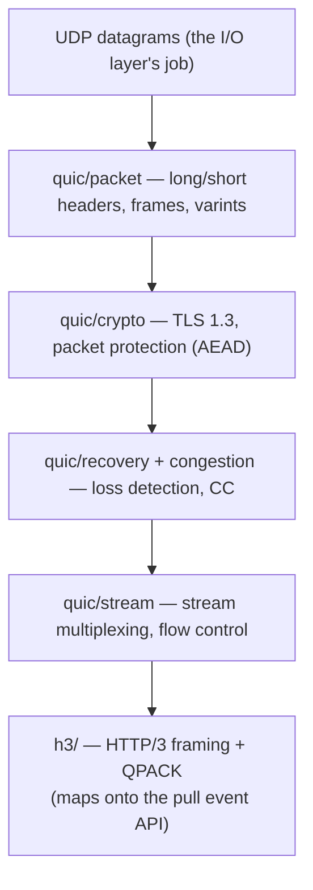

# HTTP/3 and QUIC

HTTP/3 reaches the same sans-IO pull API as HTTP/1.1 and HTTP/2 - you pick the
protocol at construction:

```python
conn = zttp.Connection(zttp.SERVER, protocol=zttp.HTTP3)
conn.receive_datagram(udp_payload)          # one UDP datagram in
while (event := conn.next_event()) is not zttp.NEED_DATA:
    ...                                      # Request / Data / EndOfMessage, each with .stream_id
for dgram in conn.datagrams_to_send():       # UDP datagrams out
    sock.sendto(dgram, addr)
```

The difference from HTTP/1.1 and HTTP/2 is the layer underneath. HTTP/1.1 and
HTTP/2 run over TCP, so the kernel hands zttp an ordered, reliable byte stream and
the core only has to *parse* it. HTTP/3 runs over **QUIC**, a transport built on
UDP, so the core also has to *be* the transport: it owns packet protection, the
TLS 1.3 handshake, loss recovery, congestion control, flow control, and stream
multiplexing. Everything QUIC normally delegates to the OS for TCP, zttp does
itself.

The sans-IO discipline is unchanged: the core never touches a socket. The I/O
layer feeds it UDP datagrams with `receive_datagram` and drains the datagrams it
wants to send with `datagrams_to_send`. The boundary moved from "decrypted byte
stream" (TCP) down to "UDP datagram" (QUIC), but the shape - bytes in, events and
bytes out, no I/O in the core - is identical.

## The layer cake



Each layer is pure Zig and tested on its own, exactly like the H1 and H2 cores.
Bottom-up, the pieces are:

### `quic/` - the transport

* **`varint`** - QUIC's 1/2/4/8-byte variable-length integer (RFC 9000 §16). The
  most-used primitive in the whole stack: every frame field, every packet number,
  every stream id is a varint.
* **`packet`** - the long-header (Initial / Handshake / 0-RTT / Retry) and
  short-header (1-RTT) packet formats, packet-number encoding/decoding, and the
  QUIC frame codec (the ~20 frame types: PADDING, PING, ACK, CRYPTO, STREAM,
  RESET_STREAM, MAX_DATA, CONNECTION_CLOSE, ...).
* **`crypto`** - the AEAD packet protection (header protection + payload
  encryption) keyed off the TLS 1.3 handshake, and the handshake state machine
  itself driven through QUIC's CRYPTO frames. This is the load-bearing security
  layer: a bug here is a transport-security bug, not just a parse bug.
* **`recovery`** - RFC 9002 loss detection: per-packet-number-space ack tracking,
  RTT estimation, the probe-timeout (PTO) timer, and which packets to retransmit.
* **`congestion`** - the NewReno controller (slow start, congestion avoidance,
  recovery) gating how much in-flight data the sender allows.
* **`flow`** - connection-level and stream-level flow control (MAX_DATA /
  MAX_STREAM_DATA / MAX_STREAMS accounting), the QUIC backpressure mechanism.
* **`stream`** - the QUIC stream layer: send/recv state machines, reassembly of
  out-of-order STREAM frames into an ordered byte run per stream, and stream-id
  typing (client/server, bidi/uni).
* **`connection`** - the transport orchestrator: ties the packet, crypto,
  recovery, congestion, flow, and stream layers into one connection, and exposes
  "give me the next ordered bytes for stream N" upward to `h3/`.

### `h3/` - the HTTP/3 layer

On top of ordered QUIC stream bytes, HTTP/3 is comparatively small - it is HTTP/2
without the parts QUIC already provides (no connection-level framing for
multiplexing, no flow control, no `PING`; those moved down into QUIC).

* **`frame`** - the HTTP/3 frame codec. Frames are dead simple: a varint type, a
  varint length, a payload. The types are DATA, HEADERS, SETTINGS, GOAWAY,
  MAX_PUSH_ID, CANCEL_PUSH, PUSH_PROMISE.
* **`stream`** - HTTP/3 stream typing: the unidirectional control stream (carries
  SETTINGS), the QPACK encoder/decoder streams, and the bidirectional request
  streams. The first byte of each uni stream is a varint stream type.
* **`qpack/`** - QPACK (RFC 9204), the HTTP/3 header compression. Like HPACK but
  redesigned so head-of-line blocking across QUIC streams is avoidable: a static
  table, a Huffman code (the same one as HPACK, Appendix B of RFC 7541), and a
  dynamic table whose updates ride dedicated encoder/decoder streams. The decoder
  must handle the "blocked stream" case where a request references a dynamic-table
  entry that hasn't arrived yet.
* **`connection`** - the orchestrator: classifies incoming streams, runs the
  SETTINGS exchange, reassembles HEADERS (QPACK-decoded) + DATA into the shared
  `Request` / `Data` / `EndOfMessage` events, and surfaces the H3 control events.

## Mapping onto the pull API

The multiplexing problem is the same as HTTP/2's and gets the same answer: a
single, arrival-ordered event queue where every event carries a `stream_id`, and
the caller demuxes on it. QUIC stream ids are 62-bit varints (not H2's 31-bit), so
`stream_id` widens to a `u64`, but the contract - one event per `next_event`, flat
queue, demux on `stream_id` - is byte-for-byte the H2 contract.

The `Request` / `Response` / `Data` / `EndOfMessage` payloads are **shared** with
HTTP/1.1 and HTTP/2: an H3 request collapses its pseudo-headers (`:method`,
`:path`, `:scheme`, `:authority`) into the same shape H2 uses. HTTP/3 gets its own
event union (`H3Event`) for the control events it actually has (`Settings`,
`Goaway`), exactly as H2 has `H2Event` - so each protocol's surface is exactly as
wide as its reality.

## Where the I/O boundary sits

The one API shift HTTP/3 forces: TCP gives an ordered byte stream, so HTTP/1.1 and
HTTP/2 take `receive_data(bytes)`. QUIC is packet-oriented and the transport needs
to see datagram boundaries (a packet number space is per-datagram, coalesced
packets share a datagram), so HTTP/3 takes `receive_datagram(bytes)` and emits
`datagrams_to_send()`. The event side is unchanged.

## Security

QUIC folds transport security into the protocol, so the threat surface is larger
than a pure parser's. The defenses live in the core:

* **Packet protection** - every 1-RTT packet is AEAD-authenticated; a forged or
  tampered packet fails the AEAD tag and is dropped, not parsed.
* **Amplification limit** - before the peer's address is validated, the server
  sends at most 3x the bytes it received (RFC 9000 §8.1), defeating reflection
  amplification.
* **Flow control** - per-stream and connection MAX_DATA caps bound how much a peer
  can make the receiver buffer.
* **Stream and frame limits** - MAX_STREAMS caps concurrency; the QPACK
  decoded-size cap and dynamic-table ceiling defend the QPACK bomb the same way
  the HPACK caps do.
* **Stateless reset and retry** - handled in the packet layer so a malformed or
  spoofed Initial cannot wedge the connection.

As everywhere else in zttp, a fatal transport or protocol error poisons the
connection terminally.

## Scope

QUIC and HTTP/3 are large. The work lands bottom-up - varints and packets first,
then crypto, then recovery and congestion, then streams, then the HTTP/3 framing
and QPACK on top - each layer tested in isolation before the next builds on it.
The server read path comes first (the uvicorn-critical direction), mirroring how
HTTP/2 was staged.
