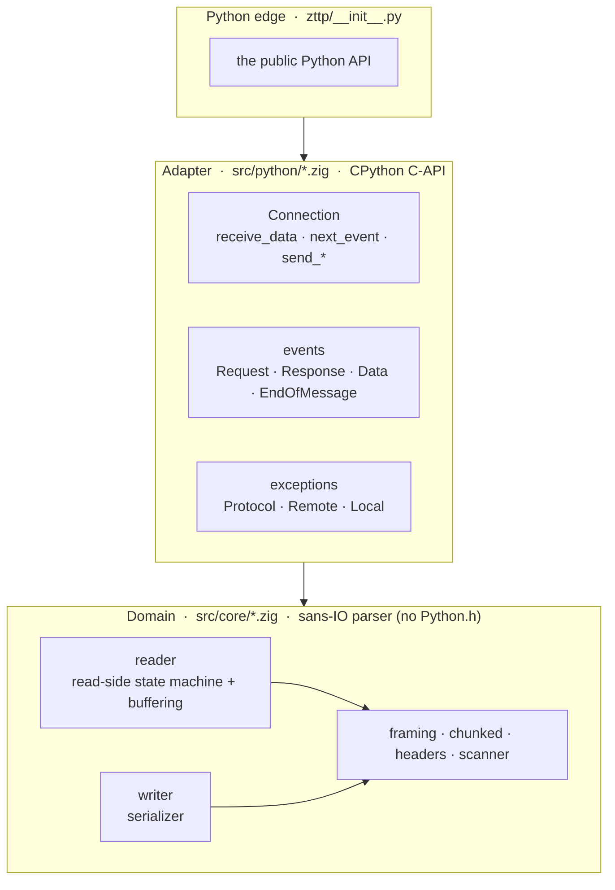

# Architecture

zttp is layered the same way [zloop](https://github.com/Kludex/zloop) is: a pure
Zig core that knows nothing about Python, a thin C-API adapter at the edge, and a
small Python package on top. Each layer depends only on the one below it.

## The core (`src/core`)

Pure Zig, no CPython. This is the parser: a [sans-IO](sans-io.md) state machine
that turns bytes into events and back. It's where the real work and the real
tests live, and it builds and runs entirely on its own with `zig build test`.

The pieces:

* **`scanner`** - the byte-level primitives (find a line ending, slice a token),
  with a SWAR scan for newlines.
* **`headers`** - parse the request/status line and header fields.
* **`framing`** - decide how a body is delimited (Content-Length vs chunked), and
  reject the ambiguous combinations that enable request smuggling.
* **`chunked`** - a resumable decoder for the chunked transfer-coding, trailers
  included.
* **`reader`** - the read-side state machine. Owns the growing input buffer,
  tracks how far parsing has progressed, and emits events.
* **`writer`** - the mirror: serialize a head, body, and trailers to bytes.

Because the core is Python-agnostic, every slice it hands out points into a buffer
it owns - and anything that must outlive the next call is copied into stable
storage. That discipline is what keeps the parser memory-safe under adversarial,
fragmented input.

## The adapter (`src/python`)

The only code that touches `Python.h`. It's a thin translation layer:

* **`py.zig`** - ergonomic helpers over the CPython C-API (refcounting, building
  `bytes`, creating types).
* **`connection_obj.zig`** - the `Connection` type. Holds a core `Reader` and
  `Writer`, and exposes `receive_data` / `next_event` / `send_*` / `data_to_send`.
* **`events_obj.zig`** - the event types (`Request`, `Data`, ...). It materializes
  the core's byte slices into real Python `bytes` objects so they're safe to keep.
* **`exceptions.zig`** - the `ProtocolError` family.

## The package (`zttp/`)

Just the public surface: `Connection`, the roles, the events, the exceptions, and
the `NEED_DATA` sentinel - with type stubs and a `py.typed` marker.

## Why Zig

Zig gives a small, dependency-free C-ABI extension with manual control over memory
and layout - the things that make a parser fast - without the build complexity of
C++ or the overhead of a heavier runtime. The same Zig source cross-compiles to
every platform's wheel, and the safety-checked build mode turns would-be
memory bugs into clean, trapped errors.
