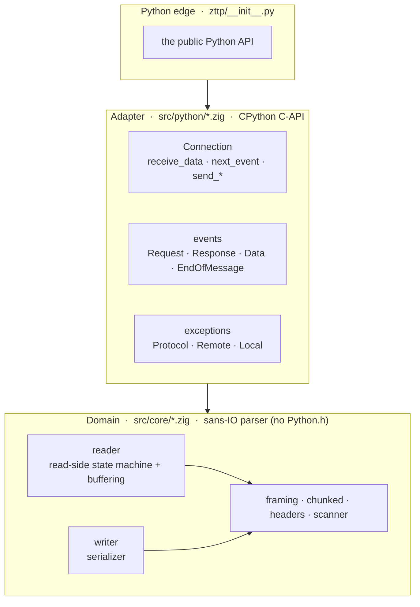

# Architecture

zttp is layered the same way [zloop](https://github.com/Kludex/zloop) is: a pure
Zig core that knows nothing about Python, a thin C-API adapter at the edge, and a
small Python package on top. Each layer depends only on the one below it.



## The core (`src/core`)

Pure Zig, no CPython. This is the parser: a [sans-IO](sans-io.md) state machine
that turns bytes into events and back. It's where the real work and the real
tests live, and it builds and runs entirely on its own with `zig build test`.

The pieces:

* **`scanner`** - the byte-level primitives (find a line ending, slice a token),
  with a SWAR scan for newlines.
* **`headers`** - parse the request/status line and header fields.
* **`framing`** - decide how a body is delimited (Content-Length vs chunked), and
  reject the ambiguous combinations that enable request smuggling.
* **`chunked`** - a resumable decoder for the chunked transfer-coding, trailers
  included.
* **`reader`** - the read-side state machine. Owns the growing input buffer,
  tracks how far parsing has progressed, and emits events.
* **`writer`** - the mirror: serialize a head, body, and trailers to bytes.
* **`h2/`** - the HTTP/2 layer (see [below](#http2)): a frame codec, HPACK, a
  per-stream state machine, and a connection orchestrator, composed the same way.

Because the core is Python-agnostic, every slice it hands out points into a buffer
it owns - and anything that must outlive the next call is copied into stable
storage. That discipline is what keeps the parser memory-safe under adversarial,
fragmented input.

## The adapter (`src/python`)

The only code that touches `Python.h`. It's a thin translation layer:

* **`py.zig`** - ergonomic helpers over the CPython C-API (refcounting, building
  `bytes`, creating types).
* **`connection_obj.zig`** - the `Connection` type. A `protocol=` selector backs
  it with either the HTTP/1.1 `Reader`+`Writer` or the HTTP/2 engine; both expose
  the same `receive_data` / `next_event` / `send_*` / `data_to_send`.
* **`events_obj.zig`** - the event types (`Request`, `Data`, ...). It materializes
  the core's byte slices into real Python `bytes` objects so they're safe to keep.
  `fromH1Event` / `fromH2Event` map each protocol's event union onto them.
* **`exceptions.zig`** - the `ProtocolError` family.

## The package (`zttp/`)

Just the public surface: `Connection`, the roles, the events, the exceptions, and
the `NEED_DATA` sentinel - with type stubs and a `py.typed` marker.

## HTTP/2 { #http2 }

HTTP/2 reuses the same sans-IO pull API; you pick the protocol when you build the
connection:

```python
conn = zttp.Connection(zttp.SERVER, protocol=zttp.HTTP2)
```

The design problem is that one HTTP/2 connection multiplexes many concurrent
streams, but `next_event()` is a single, flat pull. The resolution: a **single,
frame-arrival-ordered queue** where every event carries a `stream_id` and the
caller demuxes on it. Wire order is forced anyway - HPACK's dynamic table is
connection-global and order-dependent, so frames must be processed in the order
they arrive - so a flat queue is the only correct shape. One frame fans out into a
small bounded ring (a `HEADERS` with `END_STREAM` yields `Request` + `EndOfMessage`),
drained one event per call, which preserves the one-event-per-`next_event` contract
the H1 reader already has.

The `Request` / `Response` / `Data` / `EndOfMessage` payloads are **shared** with
HTTP/1.1 (an H2 request collapses its pseudo-headers - `:method` -> method, `:path`
-> target, `:authority` -> a synthesized `host` header - into the same shape), but
each protocol has its **own event union** (`H1Event` / `H2Event`): H2 adds the
control events (`RstStream`, `Goaway`, `Settings`, `Ping`, `WindowUpdate`) and has
no `connection_closed`, so each protocol's surface is exactly as wide as its reality.

The `h2/` modules compose like the H1 core does:

* **`frame`** - the zero-copy frame codec (the 9-octet header, padding, the 10
  frame types) and serializer.
* **`hpack/`** - the static table, a Huffman decoder, the stateful header-block
  decoder (dynamic table + eviction), and a stateless encoder.
* **`stream`** / **`settings`** - the per-stream state machine (with the exact
  stream-vs-connection error classification) and SETTINGS parsing/validation.
* **`connection`** - the orchestrator: the preface/SETTINGS handshake, HEADERS +
  CONTINUATION reassembly, DATA, trailers, flow control, and the control frames.
* **`writer`** - the write side: handshake, HEADERS/DATA serialization, and the
  control frames.

The known HTTP/2 denial-of-service classes are defended in the core: the
CONTINUATION flood (byte and frame caps on the open header block), the HPACK bomb
(an incremental decoded-size cap and a dynamic-table ceiling), Rapid Reset (a
reset-accounting cap), and flow-control and padding-underflow guards. A connection
error poisons the connection terminally, exactly as a parse error does on the H1
side.

## Why Zig

Zig gives a small, dependency-free C-ABI extension with manual control over memory
and layout - the things that make a parser fast - without the build complexity of
C++ or the overhead of a heavier runtime. The same Zig source cross-compiles to
every platform's wheel, and the safety-checked build mode turns would-be
memory bugs into clean, trapped errors.
