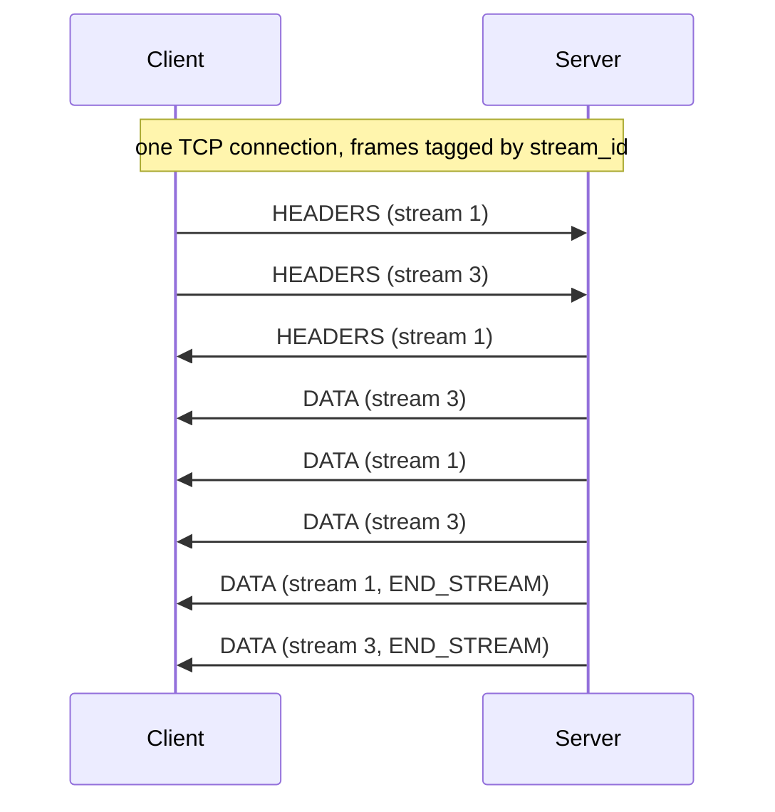

# HTTP/2

You already know the zttp API: feed bytes with `receive_data`, pull events with
`next_event`, ask for bytes with `data_to_send`. **HTTP/2 is the same API.** You
opt in with one argument, and the events you already know (`Request`,
`Response`, `Data`, `EndOfMessage`) come back, now tagged with the stream they
belong to.

```python
import zttp

conn = zttp.Connection(zttp.SERVER, protocol=zttp.HTTP2)
```

The only new thing is `protocol=zttp.HTTP2`. Leave it off and you get HTTP/1.1,
exactly as before.

!!! note "Prior knowledge"
    zttp speaks HTTP/2 over a plain connection (the *prior-knowledge* mode, and
    what you get after ALPN or an upgrade negotiates `h2`). zttp does no I/O and
    no TLS: it parses and serializes the HTTP/2 framing once you have the bytes.

## How HTTP/2 works

You already know HTTP/1.1. You open a connection, you send a request, you
wait, you get a response back. It is simple, it is text, and you can read
it with your own eyes.

HTTP/2 keeps the same requests and responses you already know - the same
methods, the same headers, the same bodies. It changes only *how* they
travel on the wire. So before you touch the API, let's look at the one
thing HTTP/2 really changes, and why.

### The problem with HTTP/1.1

Here is the catch with HTTP/1.1: a connection does one exchange at a time.

You send a request, and the connection is busy until the response comes
back. The next request has to wait its turn.

So if one response is slow or large, every response queued behind it
waits too. That is **head-of-line blocking** - one slow item at the front
holds up everyone behind it.

!!! note "But what about keep-alive and pipelining?"

    A common misconception is that HTTP/1.1 can only send one request per
    connection, ever. It can't - a persistent (keep-alive) connection
    happily handles many sequential exchanges.

    Pipelining went further and let a client send several requests without
    waiting. But the responses still had to come back *in request order*,
    so the head-of-line block just moved onto the responses. It was poorly
    supported and basically never used.

Because the connection serializes everything, browsers got creative. And
the workarounds are not pretty:

| Workaround | What it does | Why it hurts |
| --- | --- | --- |
| Many connections | Open several TCP connections per origin (browsers cap around 6) | Multiplies handshake cost and memory, and the connections compete for bandwidth |
| Domain sharding | Spread assets across extra hostnames for even more connections | More handshakes, worse congestion behavior |
| Inlining and bundling | Data-URI inlining, CSS sprites, concatenating files | One byte changes and the whole bundle re-downloads - caching suffers |

These all exist for one reason: to dodge the one-exchange-at-a-time
limit. HTTP/2 removes the limit, so the workarounds go away.

### One connection, many streams

Here is the one big idea.

HTTP/2 is **binary** and **framed**. Instead of a text message, the
connection is a continuous flow of small **frames**. Every frame starts
with the same fixed 9-octet header: a length, a type, some flags, and a
**`stream_id`**.

That `stream_id` is the magic. A **stream** is one independent,
bidirectional conversation - basically one request and its response. Many
streams live on the same connection at the same time, and because every
frame is tagged with its `stream_id`, the connection can **interleave**
frames from different streams as they are ready.

This is **multiplexing**. One connection, many conversations, all in
flight together.



See how stream `1` and stream `3` are mixed together? A slow response on
stream `1` no longer blocks stream `3`. They share the road, but they no
longer queue behind each other.

A few rules keep the streams tidy:

| Rule | Detail |
| --- | --- |
| Client streams are odd | The client's first request is stream `1`, then `3`, `5`, ... |
| Server streams are even | These only ever came from server push, which is effectively dead today |
| Stream `0` is special | It is the connection's control stream - `SETTINGS`, `PING`, `GOAWAY` live here |
| Ids only go up | Each new `stream_id` must be larger than every id used before it |

Each stream then walks a small lifecycle - `idle`, `open`, `half-closed`
once one side sends `END_STREAM`, then `closed` - and `RST_STREAM` can
slam a single stream shut without touching the others.

!!! info "This is why every zttp event carries a `stream_id`"

    Because frames from many streams arrive interleaved, the events zttp
    hands you are interleaved too. Each one tells you which stream it
    belongs to, so you can reassemble each request even though they came
    in mixed together.

### Header compression (HPACK)

Now, those headers.

In HTTP/1.1 every request sends its headers as text, in full, every
single time. Your cookies, your user-agent, your accept headers - the
same big blob, repeated on every request. That is a lot of wasted bytes.

HTTP/2 fixes this with **HPACK**, and the idea is lovely: don't send a
header twice, send a small number that points at it.

HPACK keeps two tables that the encoder and decoder share:

| Table | What's in it |
| --- | --- |
| Static table | A fixed, read-only list of 61 common entries (like `:method GET`, `:status 200`, `content-type`) |
| Dynamic table | Starts empty, fills up at runtime with headers seen on this connection, newest first |

So the first time a header goes by, it gets added to the dynamic table.
The next time, you just send its index. Tiny.

!!! info "Why this forces a strict wire order"

    The dynamic table is shared, ordered, and stateful - the encoder and
    decoder must keep *identical* tables. So headers must be encoded and
    decoded in exactly the order they were sent. You cannot decode a
    header block out of order, because each entry can shift the table for
    the next one.

    This is why zttp models an HTTP/2 connection as a single, ordered
    event queue: the protocol itself is ordered, so the parser has to be
    too.

### Flow control

There is one more thing to keep streams from stepping on each other:
**flow control**.

A fast sender shouldn't be able to flood a slow receiver, and one greedy
stream shouldn't be able to hog the shared connection's buffers. So
HTTP/2 gives every receiver a credit window at two levels - one per
stream, and one for the whole connection. A sender may only send `DATA`
up to the credit it has, and the receiver hands out more credit with
`WINDOW_UPDATE` frames (on a `stream_id` for that stream, or on stream
`0` for the connection). The initial window is `65,535` octets, and only
`DATA` frames are flow-controlled - not your headers or settings.

### The catch - it still rides on TCP

So HTTP/2 gave you multiplexing, and head-of-line blocking is solved.
Right?

Almost. And this is the most important idea on the page, so stay with me.

HTTP/2 removes head-of-line blocking at the **application layer**. Your
streams no longer queue behind each other in HTTP terms.

But all of those streams still ride on a *single* TCP connection
underneath. And TCP has one firm rule: it delivers bytes **in order**, no
gaps. If one TCP segment is lost, TCP refuses to hand *any* later bytes
to the application until that segment is retransmitted.

So picture it: a single packet drops. The frames for your other streams
may have already arrived at the machine - but TCP is holding them hostage
behind the gap. Every multiplexed stream waits.

!!! warning "Application-layer HOL vs transport-layer HOL"

    This is the distinction to get right:

    - **Application-layer** head-of-line blocking - HTTP/1.1 serializing
      responses. HTTP/2 *fixes* this with multiplexing.
    - **Transport-layer** head-of-line blocking - TCP holding back bytes
      after a lost segment. HTTP/2 *cannot* fix this, because it lives
      below HTTP/2.

    The frames are independent in HTTP's eyes, but TCP doesn't know that.
    One lost segment stalls them all.

There is even a stinging consequence: on a lossy network, a single
multiplexed HTTP/2 connection can do *worse* than several HTTP/1.1
connections, because with separate connections a loss only stalls one of
them.

To really kill head-of-line blocking, you have to drop TCP. That is
exactly what HTTP/3 does - it runs over **QUIC** (built on UDP), where
each stream is ordered independently, so a loss on one stream no longer
stalls the rest.

That tee-up matters for zttp: because the head-of-line problem lives in
the transport, fixing it means the core has to *be* the transport. But
that is HTTP/3's story. For HTTP/2, the model you now have - a connection
of `stream_id`-tagged frames, multiplexed, HPACK-compressed, and
flow-controlled - is exactly what zttp parses for you. Let's see how.

## Two connections, one base

A connection's *send* surface depends on its protocol, so zttp gives you the
right type for the protocol you asked for:

```python
import zttp

h1 = zttp.Connection(zttp.SERVER)
h2 = zttp.Connection(zttp.SERVER, protocol=zttp.HTTP2)

type(h1).__name__  #> 'H1Connection'
type(h2).__name__  #> 'H2Connection'

isinstance(h2, zttp.Connection)  #> True
```

An `H1Connection` carries the message-scoped send API you saw in
[HTTP/1.1](http1.md): `send_response`, `send_data`, `end_message` on the base
connection. An `H2Connection` makes everything **stream-scoped**, so it has no
connection-level `send_data`; you send on a [`Stream`](#streams) instead. Both
are real `Connection` subclasses, so code that only reads (`receive_data` /
`next_event` / `data_to_send`) can take either one.

!!! tip "Your editor knows"
    Because they're distinct types, calling `h2.send_data(...)` is a **type
    error**, not a runtime surprise: your editor flags it before you run.
    HTTP/2 has no single "current message" to send on, so the method simply
    isn't there.

## The read side

Reading is what you already do. The only addition is `stream_id` on every event,
because one HTTP/2 connection multiplexes many requests at once:

```python title="server_read.py"
import zttp

server = zttp.Connection(zttp.SERVER, protocol=zttp.HTTP2)
server.receive_data(incoming_bytes)

while True:
    event = server.next_event()
    if event is zttp.NEED_DATA:
        break
    if isinstance(event, zttp.Request):
        print(event.method, event.target, event.stream_id)
```

`event.stream_id` tells you which stream this `Request` arrived on. On HTTP/1.1
it's `0`; on HTTP/2 it's the real id, and every `Data` / `EndOfMessage` for that
request carries the same id.

A **client** reads the mirror image (`Response` events instead of `Request`),
again tagged with the `stream_id` of the request they answer.

## Streams

In HTTP/2 you don't send "on the connection": you send **on a stream**. A
`Stream` is a small handle with the send API scoped to one stream:

* `send_response(status, headers=None)`: a response head.
* `send_data(data)`: body bytes (flow-controlled, see [below](#flow-control)).
* `end_message(trailers=None)`: finish the message.

The connection owns the real stream state; the `Stream` is just a typed handle to
it. You get one in two ways, depending on who opens the stream.

### Client: opening a stream

The client **originates** a stream by sending a request, so `send_request`
hands you the `Stream` back:

```python title="client.py"
import zttp

client = zttp.Connection(zttp.CLIENT, protocol=zttp.HTTP2)
stream = client.send_request(b"GET", b"/", b"2", [(b"host", b"example.com")])

stream  #> Stream(stream_id=1)

stream.end_message()
print(client.data_to_send())  # the HTTP/2 frames to put on the wire
```

The version arg is ignored (it's always `2`), and `:authority` is derived from
your `host` header, so a request you'd build for HTTP/1.1 works unchanged. From
here you talk to the **stream**, not the connection: `stream.send_data`,
`stream.end_message`.

### Server: answering a stream

The server learns a stream's id by **reading** the request off it. Use
`conn.stream(id)` to get the handle for the stream you want to answer:

```python title="server.py"
import zttp

server = zttp.Connection(zttp.SERVER, protocol=zttp.HTTP2)
server.receive_data(request_bytes)
request = next(e for e in drain(server) if isinstance(e, zttp.Request))

stream = server.stream(request.stream_id)
stream.send_response(200, [(b"content-type", b"text/plain")])
stream.send_data(b"Hello, HTTP/2!")
stream.end_message()

print(server.data_to_send())
```

`drain` is just a loop over `next_event` until `NEED_DATA`: the events carry the
`stream_id` you need.

!!! tip "Many streams at once"
    Because each `Stream` names its own id, you can answer requests in **any
    order**: hold a handle per in-flight request and respond as each is ready.
    Two requests arriving before you answer either is the normal HTTP/2 case, and
    routing the responses is just `server.stream(s1)` and `server.stream(s2)`.

## Flow control

HTTP/2 has per-stream and per-connection **send windows**: the peer tells you how
many body bytes it's willing to receive, and you mustn't send past that. zttp
handles this for you, and keeps it sans-IO.

When you call `stream.send_data`, zttp emits as many bytes as the window allows
and **parks the rest**. As the peer grants more window (it sends you
`WINDOW_UPDATE` frames, which arrive as bytes you `receive_data`), zttp drains the
parked bytes automatically on the next `next_event`:

```python title="flow.py"
import zttp

stream = server.stream(1)
stream.send_response(200, [(b"content-type", b"text/plain")])
stream.send_data(b"a very large body ...")
out = server.data_to_send()                 # only what the window allowed

# ... later, the peer grants more window ...
server.receive_data(window_update_bytes)
for event in drain(server):
    ...                                      # a WindowUpdate flows past
more = server.data_to_send()                 # the parked bytes, now freed
```

You hand zttp the whole body in one `send_data` call: it never blocks and never
drops anything, sending what fits and remembering the rest. The extra window
credit arrives as ordinary inbound bytes you `receive_data` - there's no special
call - and once you drain the events the parked bytes are waiting for you on the
next `data_to_send`, framed and ready.

!!! note "Buffering is not I/O"
    Parking bytes until the window opens is bookkeeping, not I/O: zttp still
    never touches a socket, never blocks, and never waits. *When* to ask for more
    window and what your event loop does meanwhile stays yours; zttp only decides
    *how many bytes may leave now*. That's the sans-IO line. See
    [Architecture](../architecture.md).

## Control events

Beyond the `Request` / `Response` / `Data` / `EndOfMessage` you already handle,
an HTTP/2 connection surfaces the protocol's own control frames as events, so you
can observe (and react to) what the peer is doing:

| Event | Meaning |
| --- | --- |
| `Settings` | The peer announced its settings. |
| `WindowUpdate` | The peer granted flow-control credit. |
| `Ping` | A keepalive / round-trip probe. |
| `RstStream` | The peer reset a single stream. |
| `Goaway` | The peer is shutting the connection down. |

They flow out of `next_event` like any other event. Most applications can ignore
them, since zttp acts on the ones that matter (crediting windows, releasing
parked data) on its own, but they're there when you need visibility.

## Where to go next

<div class="grid cards" markdown>

-   :material-upload-network: **[HTTP/1.1](http1.md)**

    ---

    The HTTP/1.1 write side, in full: the foundation the `Stream` API mirrors.

-   :material-alert-circle: **[Errors](errors.md)**

    ---

    `LocalProtocolError` vs `RemoteProtocolError`, on both protocols.

-   :material-book-open: **[API reference](../reference/api.md)**

    ---

    `H2Connection`, `Stream`, and the control events in full.

</div>
