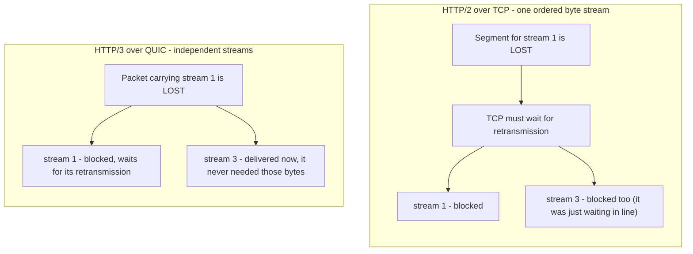

# HTTP/3

HTTP/3 is the same zttp API again: opt in with one argument, pull the same
events. The difference is the wire. HTTP/3 runs over **QUIC** on UDP, so instead
of feeding a byte stream you feed whole datagrams:

```python
import zttp

server = zttp.Connection(zttp.SERVER, protocol=zttp.HTTP3)
client = zttp.Connection(
    zttp.CLIENT,
    protocol=zttp.HTTP3,
    server_name=b"example.com",
)
```

As with HTTP/2, the `protocol` argument picks the subtype, so construction
returns an `H3Connection` and the surface you get matches the wire you chose.
zttp provides the QUIC transport defaults internally; constructor fields such as
transport parameters, connection IDs, and handshake entropy are advanced
overrides for deterministic tests and interoperability work, not the normal user
API.

The handshake's two same-typed `bytes` pairs - a server's certificate and key,
and a resumption ticket's identity and PSK - are passed as **value objects** so
they cannot be transposed. A swap is a type error, not a handshake failure:

```python
server = zttp.Connection(
    zttp.SERVER, zttp.HTTP3,
    credentials=zttp.TlsCredentials(certificate=cert, private_key=key),
)
client = zttp.Connection(
    zttp.CLIENT, zttp.HTTP3,
    server_name=b"example.com",
    resumption=zttp.SessionResumption(identity=ticket_id, psk=ticket_psk),
)
```

Omit `credentials` and the server uses an ephemeral local identity (development
only).

!!! warning "Scope"
    HTTP/3 support is still experimental. The public surface is intentionally
    the same event model as HTTP/1.1 and HTTP/2, but the transport underneath is
    new code: QUIC packet protection, loss recovery, flow control, connection
    migration, TLS 1.3, and QPACK all live inside zttp's core. The convenience
    server constructor generates an ephemeral TLS identity for each connection;
    it is suitable for local experiments, not for production server identity.

## How HTTP/3 works

You just learned HTTP/2: many requests share one connection, each on its own
stream, all interleaved. **Multiplexing.** That part HTTP/3 keeps. So you
already have the right mental model, and there is really only one new idea to
add.

That idea is the transport underneath.

### The leftover problem

HTTP/2 multiplexes streams, but it still rides on a single TCP connection, and
TCP delivers exactly one ordered byte stream. So when a single TCP segment is
lost, TCP holds back *everything* that came after it until the retransmission
arrives, even bytes that belong to completely unrelated streams. Your streams
are independent to HTTP/2, but they are not independent to TCP.

That is **head-of-line blocking**, and this time it lives at the transport
layer, below anything HTTP/2 can fix.

!!! note "HTTP/2 didn't have *no* head-of-line blocking"

    You often hear "HTTP/2 fixed head-of-line blocking." It fixed it at the
    *application* layer: no more waiting in line inside the HTTP framing. But the
    single ordered TCP stream brings it right back at the *transport* layer. One
    lost segment, every stream waits. HTTP/3's whole reason to exist is to remove
    that.

So HTTP/3 does the one thing HTTP/2 couldn't: it changes the transport.

### QUIC: a new transport on UDP

HTTP/3 runs over **QUIC**, a general-purpose transport protocol that sits on top
of UDP. UDP on its own gives you almost nothing - just "here is a datagram for
this port." Everything that makes a transport trustworthy, QUIC provides itself:
connection setup, reliability (it detects loss and retransmits), congestion
control, and flow control. The same jobs TCP did, now done in QUIC.

Here is the one change that matters. TCP orders the *whole connection*. QUIC
orders *each stream on its own*.

So when a packet is lost, QUIC only holds back the stream or streams whose bytes
were in that packet. Every other stream keeps flowing, delivered, not waiting on
anybody. That is the entire payoff.



The difference is the second column. On TCP, losing stream 1's data freezes
stream 3 for no reason. On QUIC, stream 3 sails right past. Same lost packet,
completely different outcome.

!!! info "Within one stream, order still matters"

    QUIC removes head-of-line blocking *across* streams, not *inside* one. A
    single stream is still an ordered byte stream, so a gap early in stream 1
    still holds back the later bytes of stream 1. That is fine - it is exactly
    what you want. The win is that stream 1's gap is stream 1's problem, and
    nobody else's.

This is why, just like HTTP/2, every HTTP/3 event carries a `stream_id`: each
request lives on its own client-initiated bidirectional QUIC stream, and those
streams really are independent all the way down.

### Encryption is built in (TLS 1.3)

QUIC doesn't run TLS *on top* of itself the way HTTPS runs TLS on top of TCP.
The TLS 1.3 handshake and the transport handshake are a single combined
exchange: TLS messages travel inside QUIC `CRYPTO` frames, and TLS hands QUIC
the keys it uses to protect every packet. Encryption is **mandatory** - there is
no plaintext mode - and a fresh connection is ready in one round trip, or zero
when you resume an earlier session.

!!! warning "0-RTT is replayable"

    Sending data in that first 0-RTT flight is delightful for latency, but that
    data is not forward-secret and an attacker can replay it. So only replay-safe
    requests (think idempotent ones) belong in 0-RTT. A performance treat with a
    real security string attached.

### Connection migration

Here is my favorite part.

A TCP connection *is* its four-tuple: source IP, source port, destination IP,
destination port. Change any of them - walk out of Wi-Fi range and onto cellular
- and TCP sees a different connection. The old one is gone, and you start over.

QUIC doesn't identify a connection by the address at all. It identifies it by a
**Connection ID** the endpoints chose. So when your phone switches networks and
your IP changes, the Connection ID is still the same, and the connection just...
keeps going. The download doesn't restart. The handshake doesn't repeat.

It just works.

### QPACK

HTTP/2 compressed headers with HPACK. HTTP/3 uses **QPACK**, its successor.
Same good ideas - a static table, a dynamic table, Huffman coding - redesigned
for one specific reason: HPACK assumed a single, totally ordered stream of
header blocks, and over QUIC's independent streams that assumption breaks. QPACK
is built so that compressing headers does not quietly reintroduce the very
head-of-line blocking you came here to escape. zttp advertises a bounded dynamic
table and blocked-stream limit, resumes streams that wait for encoder updates,
and falls back to static/literal encoding when the peer disables dynamic QPACK.

### Why this changes zttp's job

For HTTP/1.1 and HTTP/2, the kernel's TCP did the hard transport work and handed
zttp a clean, ordered, reliable byte stream. The core only had to **parse**.

For HTTP/3, there is no TCP to lean on. So the core has to *be* the transport:
packet protection, loss recovery, congestion control, stream reassembly - all of
it. That is also why HTTP/3 takes whole UDP datagrams instead of a byte stream:
the transport has to see real packet boundaries to do its job.

And the sans-IO line still holds: the core does all of this without ever
touching a socket.

## Datagrams in, events out

TCP hands you an ordered byte stream, so HTTP/1.1 and HTTP/2 take
`receive_data(bytes)`. QUIC is packet-oriented and the transport must see
datagram boundaries, so HTTP/3 takes `receive_datagram` instead. Pass one UDP
payload per call, exactly as it came off the socket; the QUIC layer underneath
decrypts the packets, tracks acks, and reassembles the stream bytes for you. The
event side is unchanged:

```python title="server_read.py"
import zttp

conn = zttp.Connection(zttp.SERVER, protocol=zttp.HTTP3)
conn.receive_datagram(udp_payload)

while (event := conn.next_event()) is not zttp.NEED_DATA:
    if isinstance(event, zttp.Request):
        print(event.method, event.path, event.stream_id)
```

You get the same `Request` / `Data` / `EndOfMessage` events, now tagged with the
QUIC `stream_id`. If FIN arrives with the initial HEADERS, the `Request` has
`end_stream=True` and needs no separate `EndOfMessage`. An HTTP/3 request
collapses its pseudo-headers into the same shape the other protocols use, and
`http_version` is `b"3"`.

!!! warning "`data_to_send()` returns a **list**"
    On HTTP/1.1 and HTTP/2 it returns `bytes`, because TCP is a byte stream and
    boundaries don't matter. On HTTP/3 it returns `list[bytes]` - **one UDP
    datagram per element**. QUIC's datagram boundaries are semantic (they bound
    a packet's AEAD protection), so you must `sendto` each element as its own
    datagram. Concatenating them breaks the connection.

    ```python
    for datagram in conn.data_to_send():
        sock.sendto(datagram, peer_address)
    ```

    Use [`data_to_send_with_addresses()`](../reference/api.md#zttp.H3Connection.data_to_send_with_addresses)
    instead if the peer may have migrated and you need the address to send each
    one to.

## Sending a response

The send surface is the one you already know from [HTTP/2](http2.md): responses
go out on a `Stream` handle, because a connection carries many requests at once.
`conn.stream(request.stream_id)` gets the handle, then it's
`send_response` / `send_data` / `end_message`.

Before any of that, though, QUIC has to finish its handshake, and that is just
datagrams moving in both directions. Here is a complete client-and-server
exchange with no sockets at all - the whole thing is a `transfer` helper that
hands one side's datagrams to the other:

```python title="roundtrip.py"
import zttp


def drain(conn):
    while (event := conn.next_event()) is not zttp.NEED_DATA:
        yield event


def transfer(src, dst, now):
    """Move every pending datagram from one connection to the other."""
    for datagram in src.data_to_send():
        dst.receive_datagram(datagram, now)


client = zttp.Connection(zttp.CLIENT, protocol=zttp.HTTP3, server_name=b"example.test")
server = zttp.Connection(zttp.SERVER, protocol=zttp.HTTP3)

transfer(client, server, 1000)  # ClientHello
transfer(server, client, 2000)  # ServerHello and the rest of the server's flight
transfer(client, server, 3000)  # the client's Finished - the handshake is done

stream = client.send_request(b"GET", b"/", b"3", [(b"host", b"example.test")])
stream.end_message()
transfer(client, server, 4000)

request = next(e for e in drain(server) if isinstance(e, zttp.Request))
print(request.method, request.path, request.stream_id)
#> b'GET' b'/' 0
```

The server answers on the stream the request arrived on:

```python
stream = server.stream(request.stream_id)
stream.send_response(200, [(b"content-type", b"text/plain")])
stream.send_data(b"Hello, HTTP/3!")
stream.end_message()
transfer(server, client, 5000)

for event in drain(client):
    print(event)
#> Settings(params=[(1, 4096), (7, 16), (6, 65536)])
#> Response(status_code=200, reason=b'', http_version=b'3', headers=[(b'content-type', b'text/plain')])
#> Data(data=b'Hello, HTTP/3!')
#> EndOfMessage(trailers=[])
```

That is the same `Stream` API as HTTP/2, and the same four building blocks as
HTTP/1.1. Only the transport underneath changed.

!!! note "The first client stream id is `0`"
    On HTTP/2 the client's first request is stream `1`. QUIC numbers its streams
    itself, and client-initiated bidirectional streams start at `0`, then `4`,
    `8`, ... Don't hardcode either; use the `stream_id` the event carries.

## Driving the clock

This is the one duty HTTP/3 adds that the other protocols do not have. TCP ran
its own timers inside the kernel. QUIC's timers are zttp's - but zttp is sans-IO
and will not read a clock or sleep, so **you** have to fire them.

There are two calls:

* `next_timeout()`: the absolute deadline of the next armed timer, or `None` if
  none is armed.
* `handle_timeout(now)`: fire it. This retransmits a loss probe, or closes the
  connection on an idle timeout.

!!! danger "The clock is **microseconds**"
    Every `now` you pass - to `receive_datagram`, to `handle_timeout` - and every
    deadline `next_timeout()` returns is a monotonic timestamp in
    **microseconds**. Pass milliseconds and every timer fires a thousand times
    too early; pass nanoseconds and the connection never times out. Use
    `time.monotonic_ns() // 1000`.

Skip this and nothing appears broken at first - the handshake completes, requests
flow - right up until a datagram is lost. Then nothing retransmits it, and the
connection hangs forever instead of recovering.

The loop looks like this:

```python title="clock.py"
import time


def now_us() -> int:
    return time.monotonic_ns() // 1000


async def serve(conn, sock):
    while not conn.is_closed():
        deadline = conn.next_timeout()
        timeout = None if deadline is None else max(0, deadline - now_us()) / 1_000_000

        datagram = await recv_with_timeout(sock, timeout)
        if datagram is None:
            conn.handle_timeout(now_us())  # the timer expired before anything arrived
        else:
            conn.receive_datagram(datagram, now_us())

        for event in drain(conn):
            ...  # dispatch Request / Data / EndOfMessage

        for out in conn.data_to_send():  # firing a timer can queue datagrams too
            sock.sendto(out, peer_address)

    if conn.idle_timed_out():
        ...  # closed silently by the idle timeout, no CONNECTION_CLOSE was sent
```

The shape to keep: **wait for a datagram or the deadline, whichever comes
first**, then always flush `data_to_send()` afterwards - firing a timer produces
datagrams (a probe, a close) just as receiving one does.

### Shutting down

| Call | Effect |
| --- | --- |
| `conn.shutdown(stream_id)` | Graceful HTTP/3 `GOAWAY`: stop accepting new requests, finish the ones in flight (RFC 9114 5.2). |
| `conn.close()` | Immediate QUIC `CONNECTION_CLOSE`. |
| `conn.is_closed()` | Whether the connection is finished, for either reason. |
| `conn.idle_timed_out()` | Whether it died silently on the idle timer rather than by a close. |
| `conn.close_info()` | The peer's `CONNECTION_CLOSE` as a [`CloseInfo`](../reference/api.md#zttp.CloseInfo), or `None`. |

After `close()`, flush `data_to_send()` one last time - the `CONNECTION_CLOSE`
frame is queued like anything else, and the peer only learns you left if you
actually send it.

## Serving many connections on one socket

```python
import time

import zttp

endpoint = zttp.QuicEndpoint(
    retry=True,
    retry_secret=b"replace-with-at-least-32-secret-bytes",
)


def receive(
    datagram: bytes, peer_address: bytes
) -> tuple[zttp.H3Connection | None, list[tuple[bytes, bytes]]]:
    connection = endpoint.receive_datagram(
        datagram,
        peer_address,
        time.monotonic_ns() // 1000,
    )
    return connection, endpoint.data_to_send()
```

`QuicEndpoint` routes long and short headers by destination connection ID. It
creates an `H3Connection` only for a new Initial packet. The returned connection
owns the HTTP event queue, so call `next_event()` on it after `receive()` returns.
Send each tuple from `endpoint.data_to_send()` to its accompanying peer address.

With `retry=True`, the first Initial produces a Retry packet but no connection.
The endpoint binds its authenticated token to `peer_address`. It allocates the
connection only after the client echoes a valid token in its next Initial. This
prevents a spoofed source address from making the server allocate handshake
state.

!!! warning "Share the Retry secret between workers"
    Every worker receiving datagrams for the same UDP address must use the same
    `retry_secret`. A client can receive Retry from one worker and return its next
    Initial to another. That worker must be able to authenticate the token.

Call `endpoint.next_timeout()` to get the earliest deadline across all
connections. Call `endpoint.handle_timeout(now)` when it expires. The endpoint
still does no I/O: your event loop owns the socket, clock, and timer scheduling.

See the [API reference](../reference/api.md#demultiplexing-a-shared-udp-socket)
for every endpoint method and the lower-level `parse_datagram_header` API.

## The transport is inside

For HTTP/1.1 and HTTP/2, the kernel's TCP gives zttp an ordered, reliable byte
stream and the core only parses it. For HTTP/3, the core also *is* the
transport: packet protection, loss recovery, congestion control, flow control,
and stream reassembly all live in the Zig core, written from scratch on
`std.crypto`. The sans-IO line holds: the core never touches a socket; your I/O
layer moves the datagrams.

Read [Architecture](../architecture.md) for the layering and the QUIC-as-transport
tour, including the security posture (amplification limits, AEAD packet
protection, and the QPACK bomb defenses).

## Where to go next

<div class="grid cards" markdown>

-   :material-transit-connection-variant: **[HTTP/2](http2.md)**

    ---

    The same multiplexed event model over TCP, with the full write side.

-   :material-sitemap: **[Architecture](../architecture.md)**

    ---

    How the from-scratch QUIC transport is built, layer by layer.

-   :material-shield: **[Security](../security.md)**

    ---

    The threat model: what the QUIC transport defends against, and what is yours.

</div>
